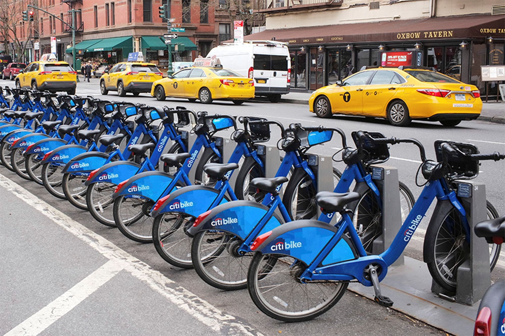
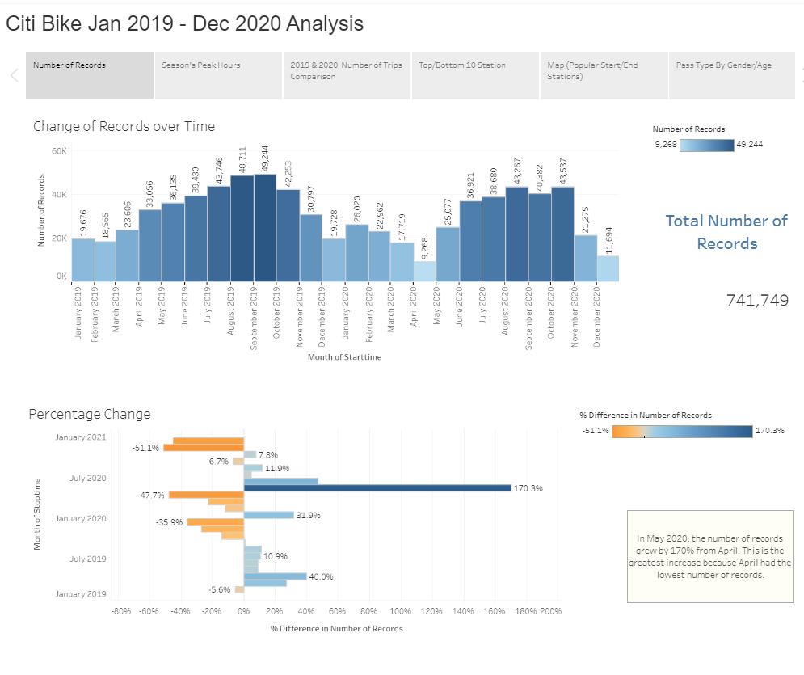

# Tableau CitiBike: January 2019 - December 2020

## Data Source

Monthly CSV files (July 2019- June 2020) were collected from [Citi Bike Data](https://www.citibikenyc.com/system-data) webpage.

## Visualizations

https://public.tableau.com/profile/fereshteh.aghaei#!/vizhome/CitiBikeAnalysis2019-2020_16132784903390/AnalysisPresentation

## Goal

Analyze CitiBike data between January 2019 and December 2020 for trends and visualize them using Tableau Public. View the Tableau Public workbook [here](https://public.tableau.com/profile/fereshteh.aghaei#!/vizhome/CitiBikeAnalysis2019-2020_16132784903390/AnalysisPresentation) (it may take a moment to load).

## Data Cleaning

Before doing any visualizations, I first used Python and the Pandas library to clean the data. In a Jupyter Notebook, I concatenated monthly data files into one, created a new column for just date only to separate start time and end time dates. I also removed all null values. Next, I converted the gender column (which was originally numerically coded) into strings. Lastly, Created a separate column for pass type to do a better visualization.

## Analysis (Jan 2019 to Dec 2020)

**The following were some questions that I used to analysis the citi-bike data:**

* How many trips have been recorded total during the chosen period?

* By what percentage has total ridership grown?

* How has the proportion of short-term customers and annual subscribers changed?

* What are the peak hours in which bikes are used during summer months?

* What are the peak hours in which bikes are used during winter months?

* Today, what are the top 10 stations in the city for starting a journey? (Based on data, why do you hypothesize these are the top locations?)

* Today, what are the top 10 stations in the city for ending a journey? (Based on data, why?)

* Today, what are the bottom 10 stations in the city for starting a journey? (Based on data, why?)

* Today, what are the bottom 10 stations in the city for ending a journey (Based on data, why?)

* Today, what is the gender breakdown of active participants (Male v. Female)?

* How effective has gender outreach been in increasing female ridership over the timespan?

* How does the average trip duration change by age?

* What is the average distance in miles that a bike is ridden?

* Which bikes (by ID) are most likely due for repair or inspection in the timespan?

* How variable is the utilization by bike ID?

* A static map that plots all bike stations with a visual indication of the most popular locations to start and end a journey with zip code data overlaid on top.

* Created a Tableau story that brings together the visualizations, requested maps, and dashboards. Click [here](https://public.tableau.com/profile/fereshteh.aghaei#!/vizhome/CitiBikeAnalysis2019-2020_16132784903390/AnalysisPresentation) 

  

  

### Copyright

Fereshteh Aghaei © 2021. All Rights Reserved.
